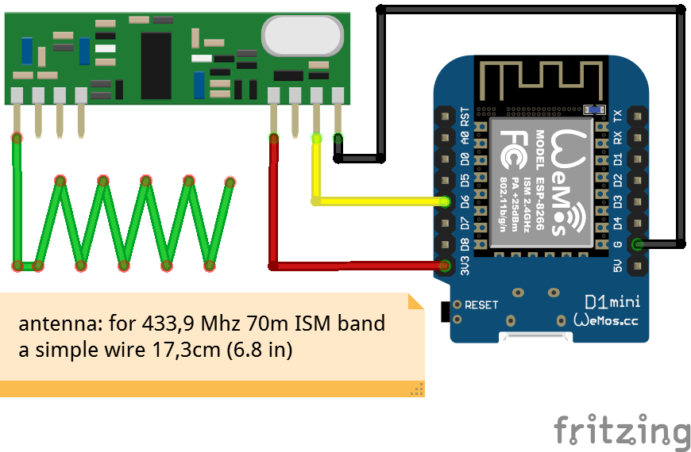

# ESPHome X10 Remote Receiver

You want to trigger HomeAssistant automations in an old fashioned way via a remote controller? This may be the solution.
There are several X10 RF remotes available. The most popular may be the Medion DIGITAINER remote from about 2000.
While most remote controls use IR signals the X10 remotes are sending 433MHz (70m ISM band) ASK signals with 20 bit codes.
This usually requires a dedicated USB-receiver. The advantage of a RF transmission is, that the receiver has not to be in sight.
The signal even gets through walls


First I tried the great [IRMP](https://github.com/IRMP-org/IRMP) library, which supports X10 RF protocol since version 3.0.0, but had no succes in decodeing the signals.
Therefore this is a slightly modified code derived from my prooved [433MHz-Sensor-Hub](https://github.com/DonKracho/ESPHome-component-433MHz-Sensor-Hub).

Currently the DIGITAINER X10 remote is the only one tested. You can choose between: 
- "DRY-TEST" emulates a code transmission with random channel and commands every 10s
- "DIGITAINER" for the Medion DIGITAINER X10 remote
- "NEC" for IR Remotes using the NEC protocol.

The 70m ISM band is a very noisy band. To avoid erratic RF receptions the code has to be detected at least twice, means you will have to press the remote button for
minimal 0.2s.

As additional hardware you will need an 433MHz AM receiver for generating pin interrupts.
It is strongly recommended to use a Superheterodyne 433MHz RF module like the 3400RF, RXB6 or RXB12.

To be honnest, with the [RXB6](docs/rxb6_datasheet.pdf) I've got the most stable results and range of reception. I really tried a lot
of these 433MHz AM receivers in the past, but **the RXB6 is the only one I do recommend to use!**
With VCC at 3.3V it provides a low noise level and detects active modulation phases very well.

These receivers operate at 3.3V without any issues. NOTE: the data output of these receivers is level based,
but has a high impedance. Therefore it may not work at GPIO pins with integrated pull up/pull down resistors!

The Rx data pulses are captured and analyzed interrupt driven. The decoding is done in the ESPHome loop()
and published to the according sensors. The Deicve, Motion and Number key pad sensos alows to do HomeAssistant automations
foe key sequences.

Wiring diagram:


A HomeAssitant automation example for toggling switches by number keys when EPG is active:
Automation X10-Remote:
```
alias: X10-Receiver
description: ""
triggers:
  - trigger: state
    entity_id:
      - sensor.x10_receiver_remote
conditions:
  - condition: state
    entity_id: sensor.x10_receiver_device_pad
    state:
      - EPG
actions:
  - action: script.wohnzimmerlicht_nummer_umschalten
    data:
      number: "{{ states('sensor.x10_receiver_command_name') }}"
mode: single
```

Script wohnzimmerlicht_nummer_umschalten:
```
fields:
  number:
    name: Nummer
    description: light number to toggle
    selector:
      text: null
    default: null
sequence:
  - choose:
      - conditions:
          - condition: template
            value_template: "{{ number == 0 }}"
        sequence:
          - action: input_boolean.toggle
            metadata: {}
            target:
              entity_id: input_boolean.wohnzimmer_szene
            data: {}
      - conditions:
          - condition: template
            value_template: "{{ number == 1 }}"
        sequence:
          - action: switch.toggle
            metadata: {}
            target:
              entity_id: switch.kronleuchter
            data: {}
      - conditions:
          - condition: template
            value_template: "{{ number == 2 }}"
        sequence:
          - action: switch.toggle
            metadata: {}
            target:
              entity_id:
                - switch.ug_switch_hub_fenster
            data: {}
      - conditions:
          - condition: template
            value_template: "{{ number == 3 }}"
        sequence:
          - action: switch.toggle
            metadata: {}
            target:
              entity_id:
                - switch.ug_switch_hub_home
            data: {}
alias: Wohnzimmerlicht Nummer umschalten
description: ""
```